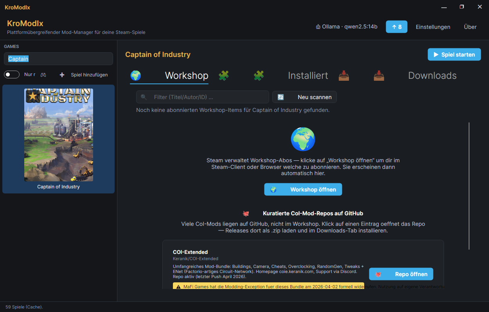

# KroModIx.Plugin.CaptainOfIndustry

[](https://github.com/KroModIx/KroModIx.Plugin.CaptainOfIndustry/actions/workflows/ci.yml)
[](https://github.com/KroModIx/KroModIx.Plugin.CaptainOfIndustry/releases)

**Captain of Industry Mod-Manager** — Plugin für den
[KroModIx](https://github.com/KroModIx/KroModIx).

Mod-Verwaltung für Captain of Industry (MaFi Games, Steam AppId 1594320)
in drei Tabs: **Workshop** (abonnierte Steam-Workshop-Items plus eine
kuratierte Liste von GitHub-Mod-Repos), **Installiert** (manuelle Mods im
Docs-Mods-Ordner, inklusive Update-Erkennung gegen die GitHub-Releases) und
**Downloads** (lokale `.zip`-Dateien installieren).

## Voraussetzungen

Braucht den [KroModIx-Host](https://github.com/KroModIx/KroModIx) **ab
v1.33.0** — dort sitzen der Backup-Baukasten, der gemeinsame
Versions-Vergleich und seit v0.6.0 der Archiv- und der GitHub-Baukasten,
gegen die dieses Plugin gebaut ist. Ältere Hosts laden das Plugin nicht.

## Screenshot



## Features

### Workshop-Tab

- **Discovery** via `IHostServices.Workshop` (Contracts v1.17+):
  Filesystem-Scan aller `<SteamLibrary>/steamapps/workshop/content/1594320/`-
  Ordner (Home + externe Platten, Bazzite-Symlink-Split-Dedupe).
- **Enrichment** via Steam-Web-API (`GetPublishedFileDetails`, public,
  kein API-Key nötig): Title, Description, PreviewUrl, Author,
  SubscriberCount, UpdatedUtc.
- **Kroste-Card-Row** mit Cover (140×90 via `_host.Images.DecodeAsync`),
  Titel, Autor · Subscriber · Größe · Datum, Beschreibung (Truncate),
  Actions (Steam öffnen / Browser öffnen / Ordner öffnen).
- **Filter-Textbox** live nach Titel/Autor/Workshop-ID.
- Sortierung: zuletzt lokal aktualisiert zuerst.

### Installiert-Tab

- Discovery aller Mod-Ordner mit `mod.json` im Docs-Mods-Verzeichnis,
  Fallback auf den Ordnernamen wenn die `mod.json` fehlt oder kaputt ist —
  der Mod bleibt sichtbar und lässt sich deinstallieren.
- Aktivieren/Deaktivieren über ein `.disabled`-Suffix am Ordner, Uninstall
  mit Rückfrage, Filter-Textbox.
- **„🔄 Updates prüfen"**: ordnet installierte Mods über den Namen der
  kuratierten Sources-Liste zu und vergleicht die Version aus der `mod.json`
  mit dem neuesten GitHub-Release-Tag. Treffer bekommen ein Update-Badge und
  einen **„⬆ Release öffnen"**-Button; die Sidebar-Kachel zeigt den grünen
  ↑-Badge.

### Downloads-Tab

- Listet `.zip`-Dateien aus dem Plugin-Downloads-Ordner, Install einzeln
  oder als Bulk.
- **Vor jedem Install** legt das Plugin einen Backup-Snapshot des
  Mods-Verzeichnisses an (Bulk: einer vor dem ganzen Durchlauf).
  Zurückspielen über das Backups-Fenster im Sidebar-Kontextmenü.

### Was das Plugin **nicht** macht

- Kein Un/Subscribe (macht Steam).
- Kein Nexus (CoI ist Workshop-only).
- Kein Auto-Download von Updates — CoI-Mods kommen als ZIP von GitHub, das
  Plugin verlinkt das Release und installiert es über den Downloads-Tab.
- Keine Update-Erkennung für Workshop-Mods (die aktualisiert Steam selbst).

### Sprachumschaltung

DE + EN. Nach Sprachwechsel im Host: Kachel neu selektieren, dann sind
die frischen Übersetzungen aktiv (Host-Tab-Cache-Invalidate seit v1.14.7).

## Build

```bash
dotnet build -c Release
dotnet test
```

## Backups vor jedem Install

Bevor das Plugin Dateien ins Spiel schreibt, legt es einen Snapshot des
Ziel-Verzeichnisses an — bei Einzel-Installs einen pro Mod, bei Bulk-Installs
**einen** vor dem ganzen Durchlauf. Zurückspielen läuft über das
Backups-Fenster im Kontextmenü der Sidebar-Kachel; es gibt bewusst kein
Auto-Rollback, damit du entscheidest, welchen Stand du zurückholst.
Aufbewahrt werden die letzten zehn Snapshots pro Spiel.

Schlägt ein Snapshot fehl, läuft der Install trotzdem durch (mit Log-Eintrag)
— das Backup ist ein Netz, kein Türsteher.

## Lizenz

MIT — siehe [LICENSE](LICENSE).
